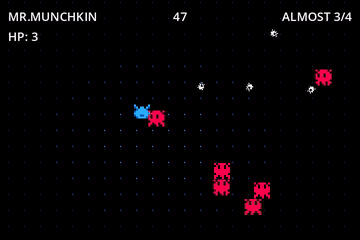
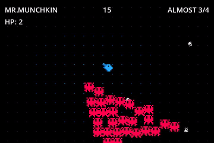

Project MUNCH
=============

 

Introduction
------------

**MUNCH** is a top-down area-like action game.

You play as *Mr. Munchkin*, a little blue fluffy boy who is always hungry.
However, he has some _enumerous_ problems with the *Litil Divils*, who want
to harm our protagonist. But then how do we fight back?

The main mechanic is allowing you to *roll the dice* for one of 5 random
abilities, which are separated between **good** are **bad**. The effect will be
applied for its custom time to you and removed afterwards.

How to play
-----------

Сollect 4 munchies and try to fight back a lot of divils with a random ability!
There's a 60% chance you'll get a good ability, 40% chance you'll get a bad
ability.

List of good abilities:

| Ability | Description                                      |
| ------- | ------------------------------------------------ |
| Panzer  | You're now a tank! You can shoot by hit `Attack` |
| Hoover  | Suck'em all up by pressing `Attack`              |

List of bad abilities:

| Ability  | Description                               |
| -------- | ----------------------------------------- |
| Blackout | Turns off most of the light around you    |
| Inverted | Messes your player controls               |
| Microman | Who's send this small **baby** to fight?! |

Controls
--------

| Action | Keyboard       |
| ------ | -------------- |
| Move   | **Arrow keys** |
| Attack | **Space**      |

Building
--------

The game is Godot 4.1.1 project.
Download the [Godot binary](https://godotengine.org/download) binary and open the project.

Inspirated by
-------------

* K.C. Munchkin for Magnavox Odyssey 2

* Roll The Dice SourceMod plugin for Team Fortress 2
